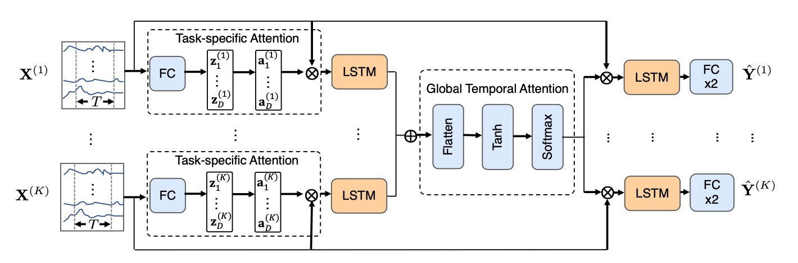
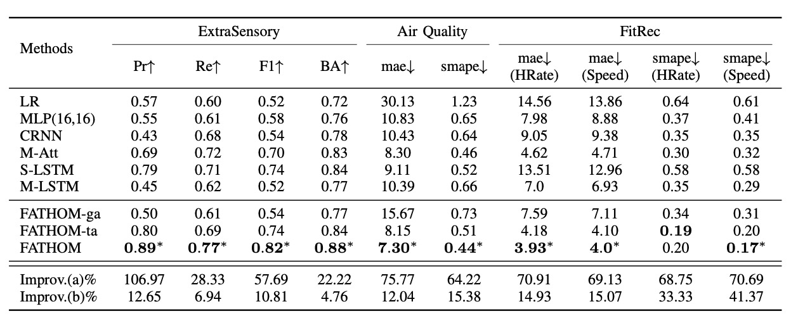

# Federated Multi-task Learning with Hierarchical Attention for Sensor Data Analytics 

A hierarchical attention model for device sensor data analytics. Task-specific attention at each device is developed to evaluate personal feature correlations, a temporal global attention layer on shared representations is created to evaluate cross-device temporal correlations.

## Datasets
Three real-world sensor datasets.

* ExtraSensory Dataset: http://extrasensory.ucsd.edu/ 
* Air Quality Dataset: https://biendata.com/competition/kdd_2018/data/
* FitRec Dataset: https://sites.google.com/eng.ucsd.edu/fitrec-project/home

## Model Summary 

  

## Key Results

  

